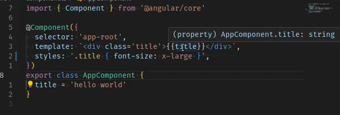
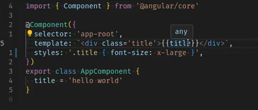

# Hot Module Replacement (HMR) Problems with Module "NodeNext"

> [!IMPORTANT]
> This was reported in [angular issue #60795](https://github.com/angular/angular/issues/60795).
> The fix was released in angular version 19.2.6.

> [!WARNING]
> This branch still uses 19.2.5 and shows the bug.
> Switch to the "fixed" branch to test the fix.
> Do not forge to run `npm install`.

> [!CAUTION]
> The issue with the LSP was not fixed within this issue.
> So leave your `tsconfig.json` with ESNext and extend it in another file to use with angular with `NodeNext`.

Setting `"module"` to `"NodeNext"` in `tsconfig.json` leads to errors during HMR, when changing the template or styles of a component.
This repository is showcasing this behaviour by providing two npm scripts `esnext` and `nodenext`.

To understand the problem further you can checkout following explanation:

## Example

TS:
```ts
@Component({
  selector: 'app-root',
  template: `<div class='title'>{{title}}</div>`,
  styles: '.title { font-size: xxx-large }',
})
export class AppComponent {
  title = 'hello world'
}
```

Running `npm run esnext` will start the dev server with `module` set to `Esnext` and `moduleResolution` set to `bundler`.
When now for example changing `font-size` to `x-large` will trigger an update, the build will be rerun,
a network request to `http://localhost:4200/@ng/component?c=src%2Fcomponent.ts%40AppComponent&t=<timestamp` will be made,
following code will be loaded and thus replaces the component with the update correctly.

```mjs
export default function AppComponent_UpdateMetadata(AppComponent, ɵɵnamespaces) {
    const ɵhmr0 = ɵɵnamespaces[0];
    AppComponent.ɵfac = function AppComponent_Factory(__ngFactoryType__) {
        return new (__ngFactoryType__ || AppComponent)();
    }
    ;
    AppComponent.ɵcmp = /*@__PURE__*/
    ɵhmr0.ɵɵdefineComponent({
        type: AppComponent,
        selectors: [["app-root"]],
        decls: 2,
        vars: 1,
        consts: [[1, "title"]],
        template: function AppComponent_Template(rf, ctx) {
            if (rf & 1) {
                ɵhmr0.ɵɵelementStart(0, "div", 0);
                ɵhmr0.ɵɵtext(1);
                ɵhmr0.ɵɵelementEnd();
            }
            if (rf & 2) {
                ɵhmr0.ɵɵadvance();
                ɵhmr0.ɵɵtextInterpolate(ctx.title);
            }
        },
        styles: ["\n\n.title[_ngcontent-%COMP%] {\n  font-size: x-large;\n}\n/*# sourceMappingURL=component.css.map */"]
    });
    (() => {
        (typeof ngDevMode === "undefined" || ngDevMode) && ɵhmr0.ɵsetClassDebugInfo(AppComponent, {
            className: "AppComponent",
            filePath: "src/component.ts",
            lineNumber: 8
        });
    })();
}
```

Running `npm run nodenext` instead will start the dev server with module set to `NodeNext`.
When doing the same change the network request will instead deliver following code:

```cjs
"use strict";
Object.defineProperty(exports, "__esModule", {
    value: true
});
exports.default = AppComponent_UpdateMetadata;
function AppComponent_UpdateMetadata(AppComponent, ɵɵnamespaces) {
    const ɵhmr0 = ɵɵnamespaces[0];
    AppComponent.ɵfac = function AppComponent_Factory(__ngFactoryType__) {
        return new (__ngFactoryType__ || AppComponent)();
    };
    AppComponent.ɵcmp = /*@__PURE__*/
    ɵhmr0.ɵɵdefineComponent({
        type: AppComponent,
        selectors: [["app-root"]],
        decls: 2,
        vars: 1,
        consts: [[1, "title"]],
        template: function AppComponent_Template(rf, ctx) {
            if (rf & 1) {
                ɵhmr0.ɵɵelementStart(0, "div", 0);
                ɵhmr0.ɵɵtext(1);
                ɵhmr0.ɵɵelementEnd();
            }
            if (rf & 2) {
                ɵhmr0.ɵɵadvance();
                ɵhmr0.ɵɵtextInterpolate(ctx.title);
            }
        },
        styles: ["\n\n.title[_ngcontent-%COMP%] {\n  font-size: x-large;\n}\n/*# sourceMappingURL=component.css.map */"]
    });
    (() => {
        (typeof ngDevMode === "undefined" || ngDevMode) && ɵhmr0.ɵsetClassDebugInfo(AppComponent, {
            className: "AppComponent",
            filePath: "src/component.ts",
            lineNumber: 8
        });
    })();
}
```

This code will throw following error:

```
zone.js:2317 ReferenceError: exports is not defined
    at component?c=src%2Fco…=1744143776918:2:23
```

## Additional problems with Module "NodeNext"

Additionally to the HMR problem the setting also seems to break the angular LSP for templates.
The local LSP of your Editor will load the `tsconfig.json` so make sure to adjust it accordingly.

With esnext it is working:



But with NodeNext it just shows `any`:


